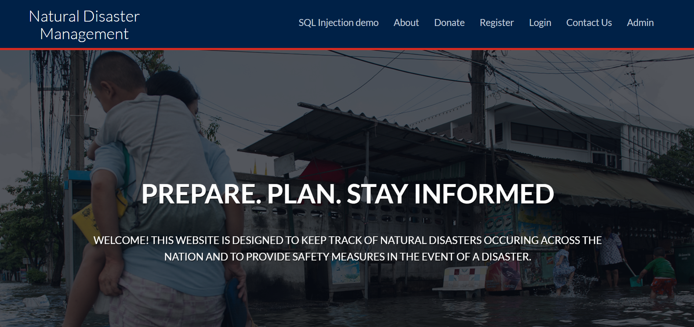

# Natural Disaster Management
This website was designed to spread information about all possible natural disasters occuring throughout the world and data of natural disasters occuring in real-time. This portal also holds information regarding the Do's and Don't's in order to safeguard oneself before a probable event, in the event of a disaster and after a disaster along with contact details to emergency services.

